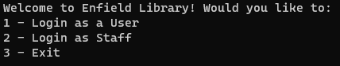
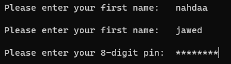
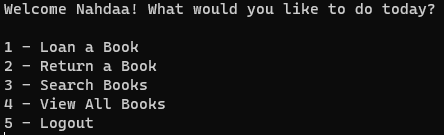
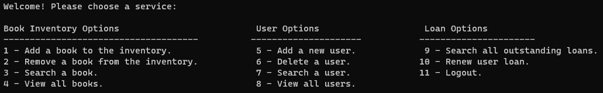
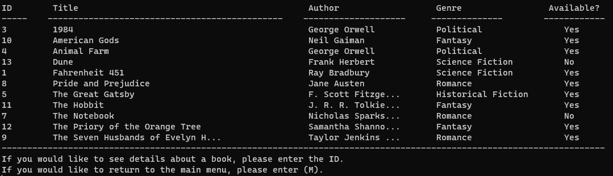

# Library Management System

  
Table of Contents

  <ol>
    <li><a href="#about-the-project">About The Project</a>
      <ul>
        <li><a href="#start-screen">Start Screen</a></li>
        <li><a href="#user-menu">User Menu</a></li>
        <li><a href="#staff-menu">Staff Menu</a></li>
      </ul>        
    <li><a href="#built-with">Built With</a></li>
    <li><a href="#challenges">Challenges</a></li>
    <li><a href="#future-features">Future Features</a></li>
    <li><a href="#contact">Contact</a>
  </ol>

## About the Project
This is a Library Management System project. This project mimics how a library system would run, including user and staff login with different functionalities.
The project is linked to a library manager database, that contains three tables. The tables are responsible for the following:
 - **Books** - This table deals with the book inventory. It has ID, title, author, description, date published, genre, and availability columns. Staff have access to this table to add and remove books from the inventory. Both staff and users can view all the books or search books in the inventory.
 - **Users** - This table deals with all the users on the system. It has ID, first name, last name, email and unique pin columns. This is used to validate login, and staff can use this table to add or delete users.
 - **Loans** - This table deals with all past and current outstanding loans. It has ID, userID, book title, book author, date loaned, date due and date returned columns. Users can loan and return a book which adds and updates the date returned in the table. Staff can renew loans so that the due date is changed to 14 days from the renewal date.

### Start Screen
The start screen prompts to either login as a user or as staff. If no user exists yet, a staff member needs to login and add a user. Either option blocks out the password using asterisks. The start screen is also where you can exit the program.

    
  

### User Menu
Once a user logs in successfully, the user menu appears. This gives the user the option to loan a book, return a book, search books or view all books. If the user is currently loaning 3 books, a message is printed saying that they are at the loan limit, and directs them back to the menu. The last option allows them to log out.

  

### Staff Menu
Once a staff member logs in successfully, they staff menu appears. The options are split by which table they affect.
The staff can add, remove, search or view all books. Staff can also add, remove, search or view all users. Lastly, staff can view all outstanding loans, and can renew loans. Like with the user menu, the last option allows them to log out.

  

Here is an example of the View All Books option. Where the availability says no, it means that the book is currently being loaned by a user.

  

## Built With
This project was built using the following technologies and languages:
- C#
- .NET
- Microsoft Visual Studio
- MySQL

## Challenges
Originally, this project used SQLite. However, as there were multiple tables and various functions calling each table simulataneously or at a similar time, the program would crash and produce a `SQLite Database is Locked` error. I tried to fix this by closing and disposing of ever reader and connection as soon as I could, and implementing `Pooling=true;` in the conenction string. However, it still crashed and displayed the same message, so I decided to switch to MySQL as it could handle multiple connections and/or transactions simultaneously.

## Future Features
In the future, I am considering creating the following features:
- **Reservation** - Allows users to reserve a book to loan even if it is currently loaned. As soon as the book is returned, the user is the first in line to loan it.
- **Fines** - If a user holds onto a book past its due date, a fine system begins that slowly increases as time goes on. For example, 1 day over = £1, 7 days over = £5 etc.
- **Overdue Alert** - Alerts a user a day or two before their book is due, and on the day its due. This could be linked to their email, so they are emailed these alerts.

## Contact

  <a href="https://www.linkedin.com/in/nahdaa-jawed/">My LinkedIn</a>

